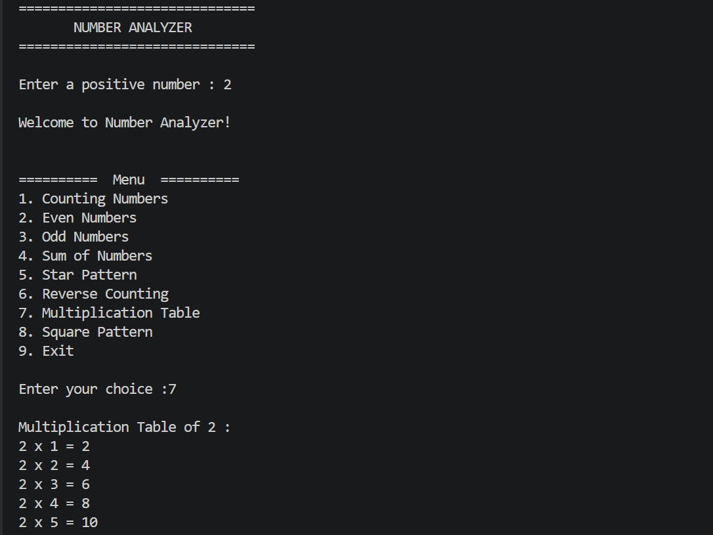

# Day 04 - Python Loops

## Topics Learned

- for loop
- while loop
- range() function
- Looping through lists
- Accumulator pattern
- break statement
- continue statement
- Nested loops
- Pattern printing

## Practice Programs

### 1. Number Processing Logic
- Process numbers using loops
- Apply conditions on data

### 2. Data Summation Logic
- Calculate total values
- Find averages from datasets

### 3. Pattern Programs
- Create increasing and decreasing star patterns

## AI Connection

Loops are used in AI for:
- Processing datasets
- Training machine learning models
- Data cleaning
- Repeating calculations

Example:

```python
for data in dataset:
    process(data)
```

# Summary

Today I learned:

- How to use `for` and `while` loops.
- How to generate sequences using `range()`.
- How to control loops with `break` and `continue`.
- How to solve number processing problems.
- How to calculate totals using loops.
- How to print different patterns using nested loops.


## Mini Project

### Number Analyzer

A menu-driven Python program that performs various number operations using loops and conditional statements.

### Features

- Count Numbers
- Even Numbers
- Odd Numbers
- Sum of Numbers
- Star Pattern
- Reverse Counting
- Multiplication Table
- Square Pattern

### Sample Output

