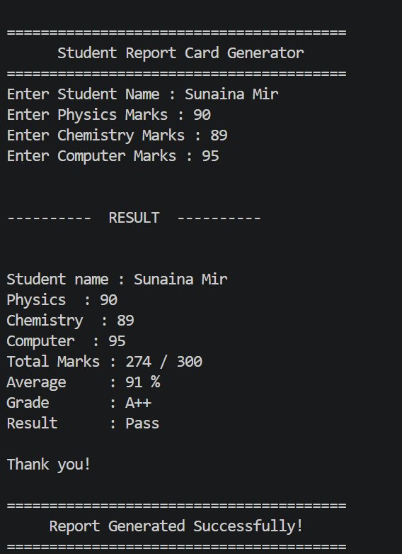

# Day 05 - Functions

## Topics Learned

- Creating Functions
- Calling Functions
- Parameters
- Arguments
- Multiple Parameters
- Return Statement
- print() vs return
- Local Variables
- Global Variables
- Default Parameters

## AI Connection

Functions make programs modular and reusable. AI libraries use functions to load data, train models, make predictions, and evaluate performance.

## What I Learned

Today I learned how to create reusable functions, pass values using parameters, return results, understand variable scope, and write cleaner, more organized Python programs.

## Mini Project

### Student Report Card Generator

A Python program that generates a student's report card using functions.

### Features

- Accepts student information
- Calculates total marks
- Calculates average
- Assigns grade
- Displays pass/fail status
- Validates marks (0–100)

### Sample Output

