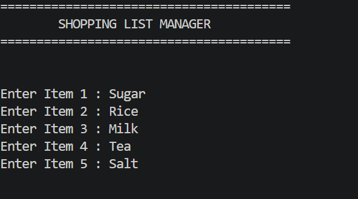
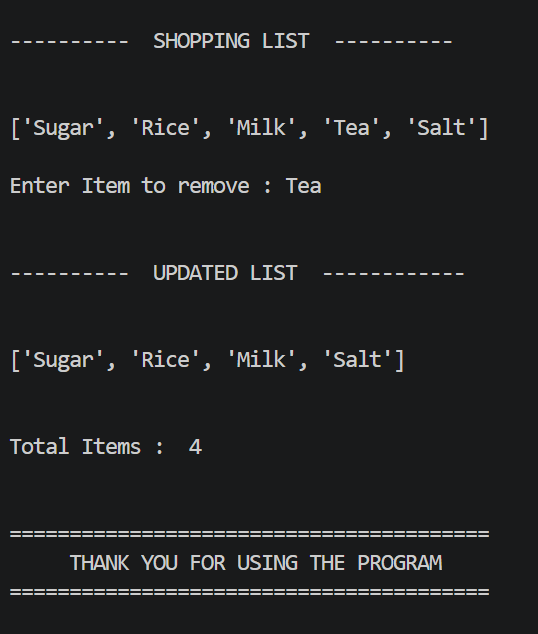

# 📚 Week 1 - Day 6: Lists (Python)

## 🎯 Objective

Learn how to use Python lists to store, access, modify, and manage multiple values efficiently.

---

# 📖 Topics Covered

- What is a List?
- List Indexing
- Negative Indexing
- List Slicing
- Slicing with Step
- append()
- extend()
- insert()
- remove()
- pop()
- clear()
- del Statement

---

# 📂 Files

| File | Description |
|------|-------------|
| `01_notes.md` | Notes covering Python Lists |
| `02_exercises.md` | 20 practice exercises with solutions |
| `03_mini_project.py` | Shopping List Manager |

---

# 🚀 Mini Project

## 🛒 Shopping List Manager

### Features

- Add shopping items
- Store items in a list
- Remove an item
- Display the updated shopping list
- Display the total number of items

---

# 🧠 Skills Practiced

- Creating Lists
- Accessing List Elements
- List Modification
- User Input
- append()
- remove()
- insert()
- len()
- Basic Program Design

---

# 🤖 AI Connection

Lists are one of the most important data structures in Artificial Intelligence.

They are commonly used to:

- Store datasets
- Store images and labels
- Store predictions
- Store model outputs
- Manage batches of training data

Understanding lists is the first step toward working with libraries like NumPy, Pandas, and TensorFlow.

---

# 📸 Screenshots

- 

- 

---

**Author:** Sunaina Mir