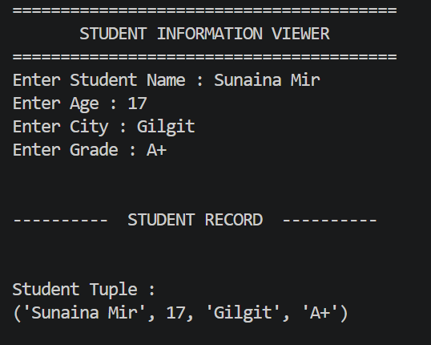
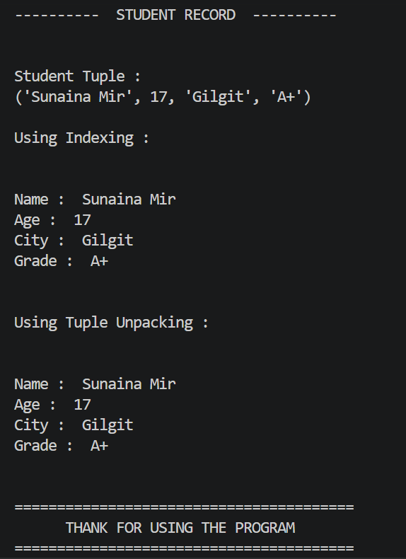

# 📅 Week 1 - Day 7 : Tuples

## 📖 Topics Covered

- What is a Tuple?
- Tuple Syntax
- Tuple vs List
- Immutable Nature of Tuples
- Single Element Tuple
- Tuple Indexing
- Negative Indexing
- Tuple Slicing
- Tuple Packing
- Tuple Unpacking
- Tuple Methods
  - count()
  - index()

---

## 📂 Files

| File | Description |
|------|-------------|
| `README.md` | Overview of Day 7 |
| `01_notes.md` | Complete notes about tuples |
| `02_exercises.md` | Practice exercises on tuples |
| `03_mini_project.py` | Student Information Viewer |

---

## 🎯 Mini Project

### Student Information Viewer

This program demonstrates the basic concepts of tuples.

### Features

- Takes student information from the user.
- Stores the information in a tuple.
- Displays tuple data using indexing.
- Displays tuple data using tuple unpacking.
- Prints the student record in a clean format.

## 📷 Project Screenshot

---

## 🧠 What I Learned

- Creating tuples
- Difference between lists and tuples
- Immutable data
- Single element tuples
- Tuple indexing
- Negative indexing
- Tuple slicing
- Tuple packing
- Tuple unpacking
- count() method
- index() method

---

## 🤖 AI Connection

Tuples are commonly used in Artificial Intelligence to store fixed information that should not change, such as:

- Image dimensions `(224, 224, 3)`
- RGB color values
- Coordinates `(x, y)`
- Model input shapes
- Fixed labels

Because tuples are immutable, they help prevent accidental modification of important data.

---

## 🚀 Progress

✅ Week 1 - Day 7 Completed
