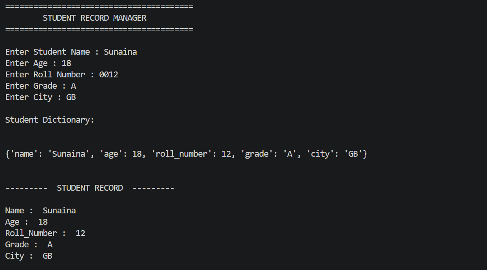
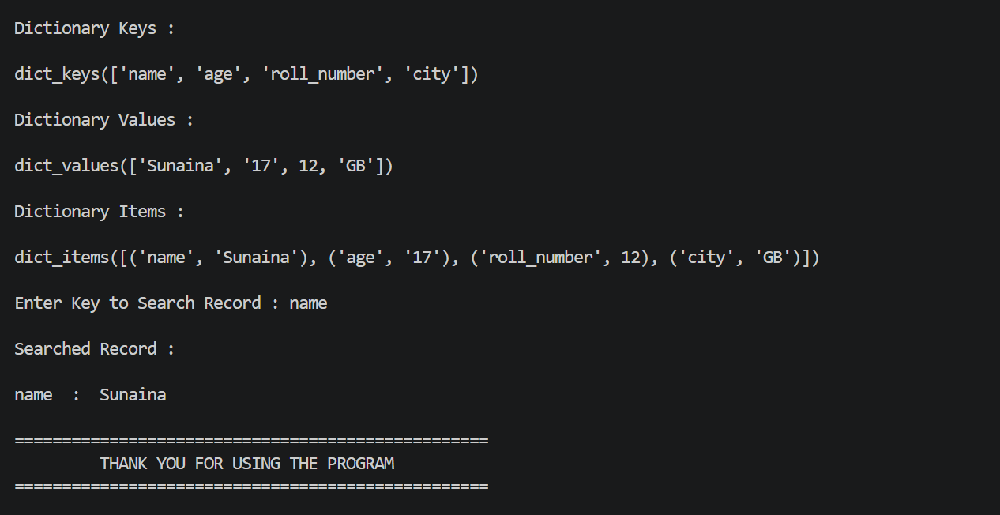

# 📘 Week 2 – Day 1: Dictionaries

## 📚 Topics Covered

* What is a Dictionary?
* Creating Dictionaries
* Key-Value Pairs
* Accessing Values
* Adding New Items
* Updating Existing Items
* Removing Items

  * `pop()`
  * `del`
  * `clear()`
* Dictionary Methods

  * `keys()`
  * `values()`
  * `items()`
  * `get()`
* Dictionary Validation
* Real-World Applications of Dictionaries

---

## 🎯 Learning Objectives

After completing this lesson, I can:

* Create dictionaries using key-value pairs.
* Access values using keys.
* Add new key-value pairs.
* Update existing values.
* Remove dictionary items safely.
* Use `keys()`, `values()`, `items()`, and `get()`.
* Understand why dictionary keys must be unique.
* Choose dictionaries over lists when storing structured data.
* Build small real-world applications using dictionaries.

---

## 📝 Exercises

This day includes **conceptual exercises** instead of basic syntax practice.

Topics include:

* Predicting program output
* Explaining dictionary behavior
* Safe data access using `get()`
* Understanding unique keys
* Dictionary reasoning questions
* Real-world problem solving

---

## 💻 Mini Project

### 🎓 Student Record Manager

A console-based Python application that demonstrates all major dictionary operations.

### Features

* Add student information
* Store data in a dictionary
* Display complete student record
* Access values using keys
* Update any field
* Remove any field safely
* Search records using `get()`
* Display:

  * Dictionary Keys
  * Dictionary Values
  * Dictionary Items
* Validate user input before updating or removing keys

---

## 🛠️ Concepts Used

* Dictionaries
* User Input
* `if` Statements
* Dictionary Methods
* Data Validation
* String Formatting

---

## 🧠 What I Learned

During this lesson, I learned that dictionaries are one of the most useful Python data structures because they store information using meaningful keys instead of indexes.

I also learned how to:

* retrieve data efficiently,
* update records,
* remove items safely,
* prevent program crashes using `get()`,
* and build more realistic Python programs.

---

## 🌍 AI Connection

Dictionaries are widely used in:

* Artificial Intelligence
* Machine Learning
* APIs
* JSON Data
* Databases
* Web Development

AI systems often store predictions, labels, model settings, and user information using dictionaries because key-value pairs make data easy to organize and retrieve.

---

## 📸 Project Screenshot

---

## 🚀 Progress

* ✅ Week 1 Completed
* ✅ Week 2 – Day 1 Completed
* 🎯 Ready for Week 2 – Day 2 (Sets)

---

**"Small progress every day builds extraordinary skills over time."** 🚀
