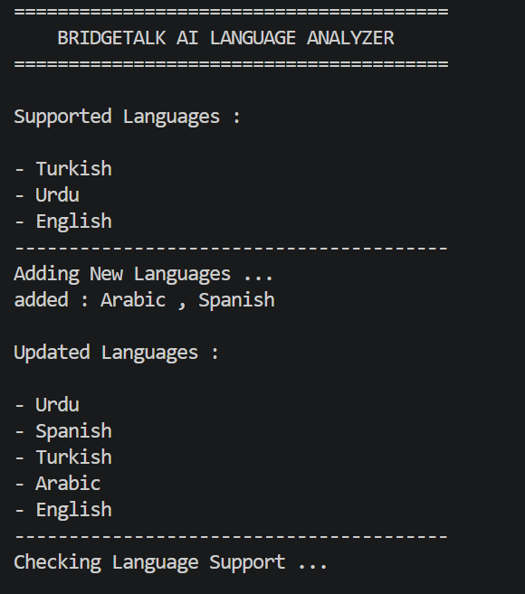
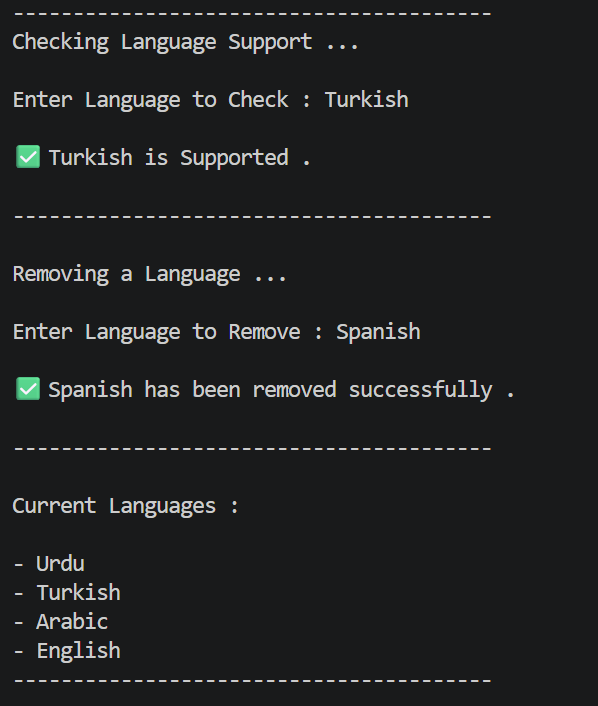
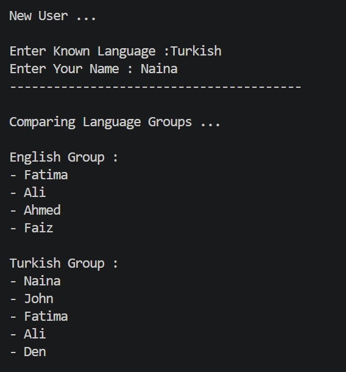
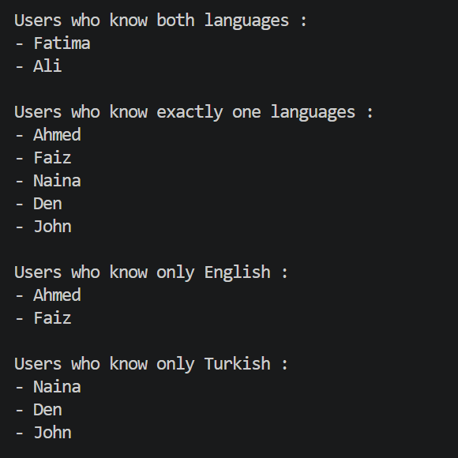
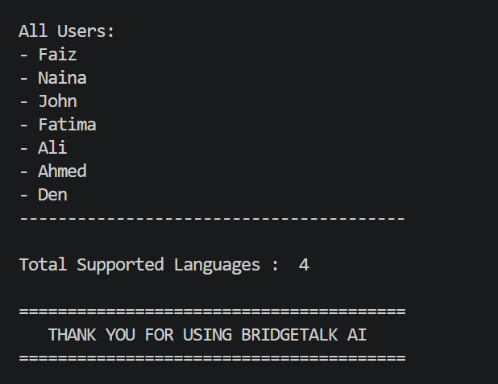

# Week 02 - Day 02: Python Sets

## Overview

This project focuses on learning **Python Sets** and their applications in data handling and AI-inspired scenarios.

## Concepts Covered

* Creating Sets
* Unique Values
* Removing Duplicates
* `add()`
* `update()`
* `remove()`
* `discard()`
* `clear()`
* `copy()`
* Membership Operators (`in`, `not in`)
* Union (`|`)
* Intersection (`&`)
* Difference (`-`)
* Symmetric Difference (`^`)
* `for` Loop with Sets
* `len()`

## Mini Project

### 🌐 BridgeTalk AI Language Analyzer

This console-based application demonstrates the practical use of Python Sets in an AI-inspired language management system.

### Features

* Display supported languages
* Add new supported languages
* Check whether a language is supported
* Remove a supported language
* Register a new user in a language group
* Compare English and Turkish language groups
* Find users who know both languages
* Find users who know exactly one language
* Find users who know only English
* Find users who know only Turkish
* Display all registered users
* Count total supported languages

## AI Connection

Sets are widely used in Artificial Intelligence and Data Science because they automatically remove duplicate data and make it easy to compare different datasets. AI systems use sets to clean data, identify common information, manage user groups, and organize unique records efficiently.

## Files Included

* `README.md` – Project overview
* `notes.md` – Python Sets notes
* `exercises.md` – Practice exercises
* `mini_project.py` – BridgeTalk AI Language Analyzer

## Screenshots

----

## Learning Outcome

After completing this project, I can:

* Create and modify Python sets
* Remove duplicate values
* Check membership using `in` and `not in`
* Apply set methods
* Perform all major set operations
* Iterate through sets using loops
* Build a real-world console application using Python Sets
* Apply Python Sets to AI-inspired scenarios
