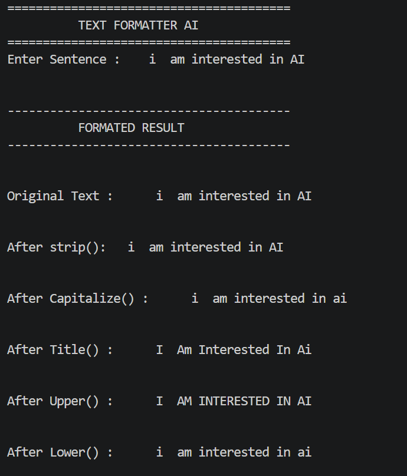
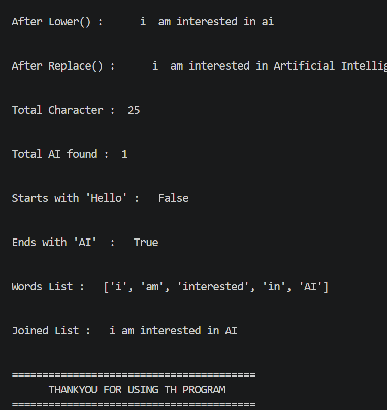

# 📅 Week 02 – Day 03
# 📝 Advanced Strings in Python

## 📖 Overview

Day 03 focused on advanced string manipulation in Python. Strings are one of the most important data types because almost every AI application, chatbot, translator, or search engine processes text. In this lesson, I learned how to clean, format, analyze, and validate text using Python's built-in string methods.

---

# 🎯 Topics Covered

- String Length (`len()`)
- Convert to Uppercase (`upper()`)
- Convert to Lowercase (`lower()`)
- Title Case (`title()`)
- Capitalize Sentence (`capitalize()`)
- Remove Extra Spaces (`strip()`)
- Replace Text (`replace()`)
- Find Text (`find()`)
- Count Occurrences (`count()`)
- Check Starting Text (`startswith()`)
- Check Ending Text (`endswith()`)
- Split String into List (`split()`)
- Join List into String (`join()`)

---

# 🤖 AI Connection

String manipulation is one of the core skills required in Artificial Intelligence and Natural Language Processing (NLP).

These methods are commonly used to:

- Clean user input before processing.
- Format chatbot responses.
- Correct spelling mistakes.
- Search for keywords.
- Count important words.
- Validate file names and commands.
- Convert sentences into lists of words for AI models.
- Rebuild processed words into readable sentences.

These concepts will be directly used in my future **BridgeTalk AI** project.

---

# 💻 Mini Project

## 📝 Project Name

**Text Formatter AI**

### Features

- Accepts a sentence from the user.
- Removes extra spaces.
- Converts text into different formats.
- Replaces specific words.
- Counts occurrences of keywords.
- Searches for text.
- Checks starting and ending words.
- Splits the sentence into words.
- Joins words back into a sentence.
- Displays a complete formatted report.

---

# 📸 Mini Project Output




---

# 📂 Files

```
Week-02/
└── Day-03-Advanced-Strings/
    ├── notes.md
    ├── 01_exercises.py
    ├── 02_mini_project.py
    └── README.md
```

---

# 🚀 What I Learned

After completing this lesson, I can:

- Clean and format text efficiently.
- Analyze strings using built-in methods.
- Validate user input.
- Convert strings into lists and lists back into strings.
- Build text-processing programs for AI applications.
- Apply string manipulation in real-world chatbot and translator projects.

---

## ✅ Status

**Week 02 – Day 03 Completed Successfully ✔️**