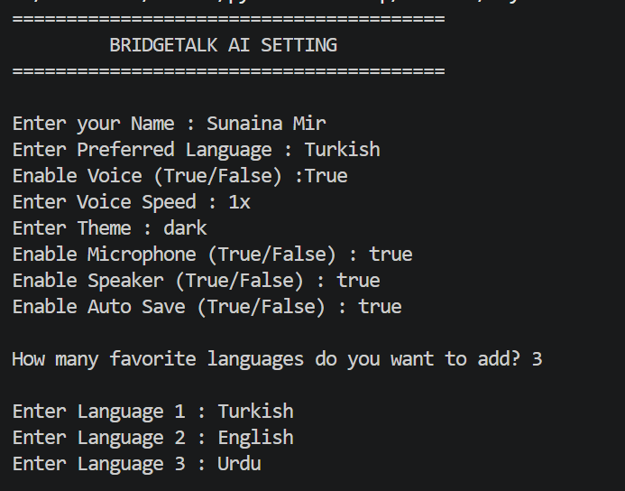
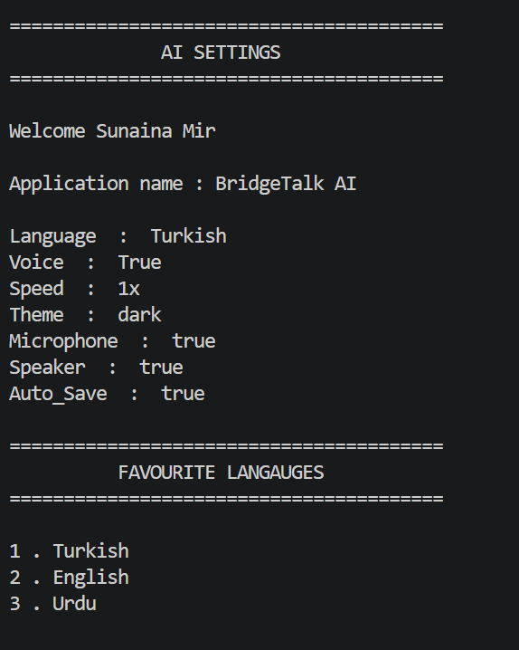
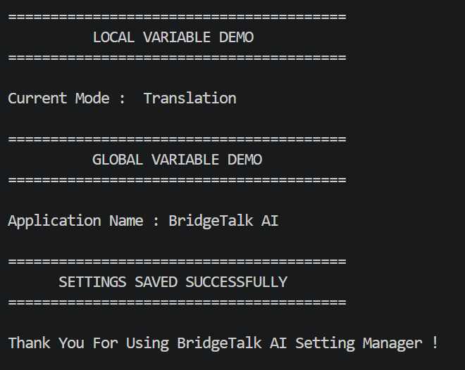

# BridgeTalk AI — Settings Manager

> **Week 2 · Day 4 | Python Functions & Scope**

A command-line settings manager developed as part of the **BridgeTalk AI** project. This application collects user preferences, manages configurable AI settings, handles multiple favorite languages, and demonstrates advanced Python function concepts.

---

## Overview

The **BridgeTalk AI Settings Manager** is a Python-based CLI application designed to simulate how an AI communication system could collect and manage user preferences.

The project focuses on writing **flexible, reusable functions** rather than handling every operation directly in the main program.

It serves as a foundation for the future development of **BridgeTalk AI**, a multilingual voice communication and translation system.

---

## Key Features

* Interactive user input
* AI language preference management
* Voice and microphone configuration
* Voice speed and theme configuration
* Dynamic favorite-language collection
* Flexible settings management with `**kwargs`
* Variable-length language handling with `*args`
* Local variable demonstration
* Global variable demonstration
* Formatted command-line interface
* Modular function-based structure

---

## Technologies

| Technology    | Purpose                                       |
| ------------- | --------------------------------------------- |
| Python        | Core programming language                     |
| Functions     | Code organization and reusability             |
| `*args`       | Handling variable-length positional arguments |
| `**kwargs`    | Handling flexible keyword-based settings      |
| Lists         | Storing favorite languages                    |
| Dictionaries  | Managing AI settings                          |
| Loops         | Processing multiple inputs                    |
| `enumerate()` | Numbering favorite languages                  |
| CLI           | User interaction                              |

---

## Application Workflow

```text
User
 │
 ├── Personal Information
 │
 ├── AI Preferences
 │
 ├── Voice Configuration
 │
 ├── Favorite Languages
 │
 ▼
BridgeTalk AI Settings Manager
 │
 ├── **kwargs → Settings Management
 │
 ├── *args → Favorite Languages
 │
 ├── Local Scope → Temporary Function Data
 │
 └── Global Scope → Application-Level Data
 │
 ▼
Formatted Settings Summary
```

---

## Core Implementation

### Variable-Length Arguments

The favorite-language system uses `*args` to allow the function to receive any number of languages.

```python
def show_languages(*languages):
    for number, language in enumerate(languages, start=1):
        print(number, ".", language)
```

This makes the function independent of a fixed number of languages.

---

### Keyword Arguments

AI settings are handled using `**kwargs`.

```python
def settings(**details):
    for key, value in details.items():
        print(key, ":", value)
```

This converts the supplied keyword arguments into a dictionary, making it easy to add new settings without redesigning the function.

---

### Local Scope

The project demonstrates how a variable created inside a function remains local to that function.

```python
def local_var():
    mode = "Translation"
    print("Current Mode :", mode)
```

---

### Global Scope

The project also demonstrates accessing an application-level variable from inside a function.

```python
app = "BridgeTalk AI"

def global_var():
    print("Application Name :", app)
```

---

## Example

A typical session allows the user to configure:

```text
Name              → Sunaina
Preferred Language → Turkish
Voice              → True
Voice Speed        → 1.5
Theme              → Dark
Microphone         → True
Speaker             → True
Auto Save           → True
```

The user can also specify multiple favorite languages, which are collected dynamically and displayed as a numbered list.

---

## Project Output

### Settings Manager





---

## Learning Outcomes

This project strengthened my understanding of:

* Function design
* Default parameters
* Positional arguments
* Keyword arguments
* Variable-length arguments
* `*args`
* `**kwargs`
* Dictionaries
* Lists
* Local scope
* Global scope
* Loops
* User input
* Modular programming

More importantly, it helped me understand how these concepts can be combined to build a **flexible application rather than isolated Python exercises**.

---

## BridgeTalk AI Connection

This project represents an early architectural step toward **BridgeTalk AI**.

A future version of BridgeTalk AI will require configurable components such as:

* Source language
* Target language
* Voice selection
* Speech speed
* Microphone input
* Speaker output
* User preferences

The current settings manager provides a foundation for handling these configurations before integrating actual translation and speech technologies.

---

## Planned Development

Future versions of BridgeTalk AI are planned to include:

* Urdu ↔ Turkish translation
* English ↔ Turkish translation
* Voice input
* Speech-to-text
* Text-to-speech
* Real-time conversation
* Microphone integration
* Configurable voice settings
* AI-powered language assistance

---

## Project Status

**Status:** Completed ✅

**Learning Phase:** Week 2 · Day 4

**Project:** BridgeTalk AI Settings Manager

**Focus:** Advanced Python Functions & Variable Scope

---

## Author

**Sunaina Mir**

Python & AI Learning Portfolio
Building toward **BridgeTalk AI** — a multilingual communication and translation project.
